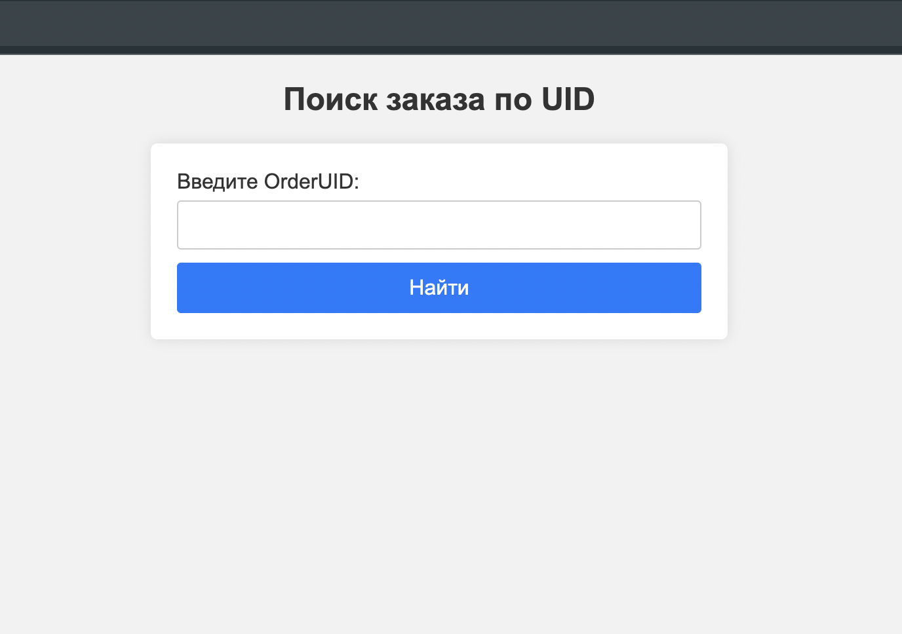
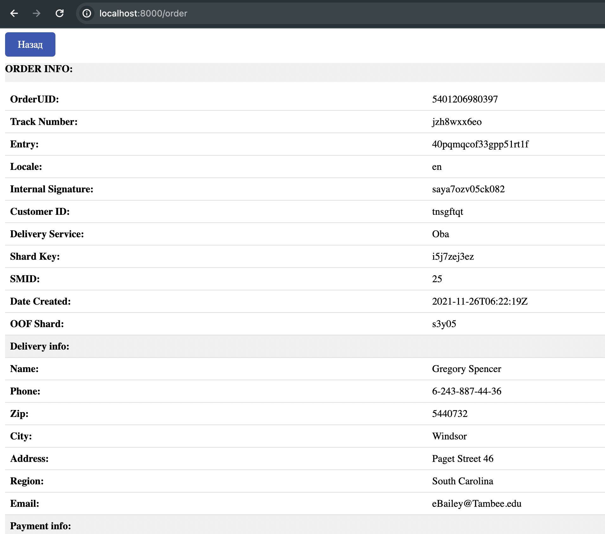

# Сервис просмотра заказа

## Описание задачи
Необходимо разработать демонстрационный сервис с простейшим интерфейсом, отображающий данные о заказе.

## Cтек
- **Язык сервиса:** Go.
- **База данных:**  PostgreSQL.


## Инструкции по сборке
- Для миграций базы данных в проект:
```bash
make migrate
```
- Для запуска nats-streaming-server:
```bash
make nats
```
- Для запуска сервиса:
```bash
make run_server
```
- Для запуска скрипта по созданию фейковых заказов:
```bash
make run_script
```
- Для удаления базы данных:
```bash
make migrate_down
```

### Пример простейшего интерфейса
- Форма поиска:


- Форма отображения заказа:


Модель данных в формате json:

<pre>
{
  "order_uid": "b563feb7b2b84b6test",
  "track_number": "WBILMTESTTRACK",
  "entry": "WBIL",
  "delivery": {
    "name": "Test Testov",
    "phone": "+9720000000",
    "zip": "2639809",
    "city": "Kiryat Mozkin",
    "address": "Ploshad Mira 15",
    "region": "Kraiot",
    "email": "test@gmail.com"
  },
  "payment": {
    "transaction": "b563feb7b2b84b6test",
    "request_id": "",
    "currency": "USD",
    "provider": "wbpay",
    "amount": 1817,
    "payment_dt": 1637907727,
    "bank": "alpha",
    "delivery_cost": 1500,
    "goods_total": 317,
    "custom_fee": 0
  },
  "items": [
    {
      "chrt_id": 9934930,
      "track_number": "WBILMTESTTRACK",
      "price": 453,
      "rid": "ab4219087a764ae0btest",
      "name": "Mascaras",
      "sale": 30,
      "size": "0",
      "total_price": 317,
      "nm_id": 2389212,
      "brand": "Vivienne Sabo",
      "status": 202
    }
  ],
  "locale": "en",
  "internal_signature": "",
  "customer_id": "test",
  "delivery_service": "meest",
  "shardkey": "9",
  "sm_id": 99,
  "date_created": "2021-11-26T06:22:19Z",
  "oof_shard": "1"
}
</pre>